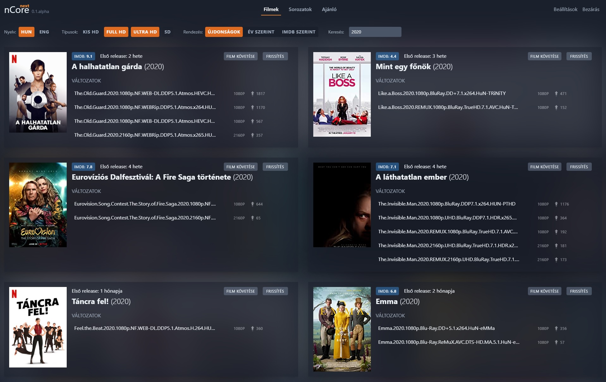

# nCore next - WIP (azaz még erősen fejlesztés alatt áll)

> It's a Hungarian project (for a hungarian website) and most of the issues/descriptions/etc are not available in english.

## Mi ez?

Unaloműző hobbi project (UserScript + Vite 2 + Vue 3 + Tailwind 2) ami egy plusz felület kínál az nCore-hoz, hogy könnyebben lehessen filmek/sorozatok között bogarászni.

## Roadmap

> **Jelenleg a az alkalmazás teljes újraírása zajlik**, az aktív branch-en (master) található kód még nem működőképes. 
> A korábbi félig-meddig működő verzió továbbra elérhető a "0.1-draft" branchen.

 A fejlesztés menete nyomonkövethető itt: [v1 - teljes funkcionalitás](https://github.com/samzlab/ncn/projects/1?card_filter_query=milestone%3A1.0)

## Screenshots (korábbi verzió)

## Telepítés

- **TamperMonkey** (vagy egyéb UserScript kompatibilis alternatíva): https://www.tampermonkey.net/

- UserScript importálása ide kattinva: https://samzlab.hu/ncn/ncore-next.user.js

## Használat

Bejelentkezés után kattints a fejlécben a piros "nCore next" linkre.

